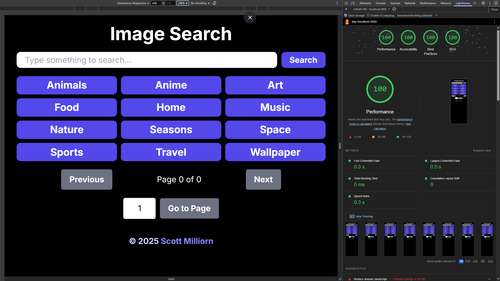

# Image Search

Image Search is a full-stack web application built with Next.js 16, React 19, and Tailwind CSS 4. It proxies the Unsplash API server-side so the API key is never exposed to the browser, and delivers paginated, filterable photo search with author browsing, dark mode, and PWA support.

**Live demo:** [image-search-black-iota.vercel.app](https://image-search-black-iota.vercel.app)

## Preview



## Features

- **Keyword Search**: Search millions of Unsplash photos by any term. Results are paginated and can be sorted by relevance or date uploaded.
- **Preset Categories**: Twelve one-click filter buttons (animals, anime, art, food, home, music, nature, seasons, space, sports, travel, wallpaper) populate the search field and fetch results immediately.
- **Sort Order**: Toggle between _Relevance_ and _Latest_ at any time without re-entering a search term.
- **Color Filter**: Narrow results by dominant color. Twelve options including black & white, black, white, and ten named colors.
- **Language Filter**: Filter results by language. Over 70 ISO 639-1 languages are supported via the Unsplash search beta endpoint.
- **Results per Page**: Choose 12, 18, 24, or 30 results per page. All values are multiples of 6, so the grid always fills evenly across 1-, 2-, and 3-column layouts.
- **Random Photos**: Toggle random mode to fetch a curated set of photos unrelated to any search query. Pagination is hidden in this mode since results differ on every request.
- **Pagination**: Navigate results with Previous / Next buttons, a page counter, and a direct page-jump input with ± stepper buttons. The Unsplash search API caps at 200 pages; the UI enforces that limit automatically.
- **Responsive Image Grid**: Results display in a 1-column mobile layout, expanding to 2 columns on large screens and 3 columns on extra-large screens. The first three images are eagerly loaded for the fastest possible LCP.
- **Image Details**: Each card shows the photo's description (or alt text), upload date, author name, location, like count, and social links (Instagram, Twitter, Portfolio, Unsplash source).
- **Author Browsing**: Click any author name to browse their uploaded photos, liked photos, or collections without leaving the page. Each view is paginated independently.
- **Dark Mode**: Toggle between light and dark themes with a single button. The initial value is read from the OS `prefers-color-scheme` media query on mount.
- **Progressive Web App (PWA)**: Installable on mobile and desktop via the included web manifest. Icons for Android (192 × 192, 512 × 512), iOS (apple-touch-icon), and desktop are included.
- **SEO**: Full metadata, Open Graph, and Twitter card tags are defined in `layout.tsx`. A machine-readable sitemap (`/sitemap.xml`) and a robots configuration (`/robots.txt`) are generated at build time.
- **Server-side API Proxy**: The Unsplash client ID lives only in `UNSPLASH_KEY` on the server. Browsers never see the key. Search responses are ISR-cached for 24 hours; user data is cached for 1 hour.

## Technology Stack

| Technology                | Version | Role                                                                                                             |
| ------------------------- | ------- | ---------------------------------------------------------------------------------------------------------------- |
| **Next.js**               | 16      | App Router, Route Handlers (API proxy), ISR caching, Turbopack                                                   |
| **React**                 | 19      | Client components, hooks (`useState`, `useEffect`, `useRef`, `useCallback`)                                      |
| **Tailwind CSS**          | 4       | Utility-first styling, dark mode via `dark:` variants, custom `xs` breakpoint                                    |
| **TypeScript**            | 5       | Strict mode with additional compile-time checks (`noUncheckedIndexedAccess`, `exactOptionalPropertyTypes`, etc.) |
| **ESLint**                | 9       | `next/core-web-vitals` + `typescript-eslint` strict rules                                                        |
| **PostCSS**               | 8       | CSS processing via `@tailwindcss/postcss`                                                                        |
| **react-spinners**        | latest  | `BarLoader` animated loading indicator                                                                           |
| **Jest**                  | 30      | Test runner with V8 coverage provider and jsdom environment                                                      |
| **React Testing Library** | 16      | Component and integration tests                                                                                  |

## Project Structure

```text
app/
├── api/
│   ├── images/route.ts                   GET /api/images            (keyword search, ISR 24 h)
│   ├── photos/random/route.ts            GET /api/photos/random     (random photos)
│   └── users/[username]/
│       ├── photos/route.ts               GET /api/users/:u/photos   (ISR 1 h)
│       ├── likes/route.ts                GET /api/users/:u/likes    (ISR 1 h)
│       └── collections/route.ts          GET /api/users/:u/collections (ISR 1 h)
├── hooks/
│   └── fetchImages.ts                    useFetchImages: memoized fetch hook with abort control
├── models/
│   ├── ApiResponse.ts                    API layer union types (success / error)
│   ├── ImageDetails.ts                   Full Unsplash photo domain model
│   ├── ImageProps.ts                     Prop types for image UI components
│   └── UIComponentProps.ts               Prop types for general UI components
├── ui/
│   ├── image/
│   │   ├── ImageCard.tsx                 Single photo card with thumbnail and error fallback
│   │   ├── ImageDetailsDisplay.tsx       Photo metadata, author, social links, and navigation buttons
│   │   └── ImageGrid.tsx                 Responsive grid of ImageCards
│   ├── FilterButtonsGrid.tsx             Preset category buttons
│   ├── Footer.tsx                        Site footer with copyright and author link
│   ├── LoadingIndicator.tsx              Centered BarLoader spinner
│   ├── PaginationControls.tsx            Prev/Next, page counter, and page-jump input
│   └── SearchInput.tsx                   Keyword search form
├── utils/
│   └── constants.ts                      IMAGES_PER_PAGE, PER_PAGE_OPTIONS, UNSPLASH_MAX_PAGES,
│                                         imageButtons, COLORS, LANGUAGES
├── globals.css                           Tailwind base styles, CSS variables, custom breakpoint
├── layout.tsx                            Root HTML shell, metadata, viewport, Footer
├── manifest.ts                           PWA web manifest
├── page.tsx                              Home page: all search state and UI composition
├── robots.ts                             /robots.txt generation
└── sitemap.ts                            /sitemap.xml generation
```

## API Routes

All routes are Next.js App Router Route Handlers. The Unsplash client ID (`UNSPLASH_KEY`) is read server-side on every request and is never forwarded to the client.

Every successful response follows the same JSON shape so the `useFetchImages` hook can consume all five endpoints without branching on the URL:

```json
{
  "results": [
    /* ImageDetails[] */
  ],
  "total_pages": 42
}
```

Error responses always follow:

```json
{ "message": "Human-readable description of what went wrong." }
```

### `GET /api/images`

Proxies the Unsplash [Search Photos](https://unsplash.com/documentation#search-photos) endpoint. Responses are ISR-cached for **24 hours**.

| Parameter  | Type   | Default       | Description                                          |
| ---------- | ------ | ------------- | ---------------------------------------------------- |
| `query`    | string | _(required)_  | Keyword search term                                  |
| `page`     | number | `1`           | Page number (min 1)                                  |
| `per_page` | number | `12`          | Results per page (1–30)                              |
| `lang`     | string | `"en"`        | ISO 639-1 language code                              |
| `order_by` | string | `"relevance"` | `"relevance"` or `"latest"`                          |
| `color`    | string | _(none)_      | Dominant color filter (optional; omit for any color) |

### `GET /api/photos/random`

Proxies the Unsplash [Random Photos](https://unsplash.com/documentation#get-a-random-photo) endpoint. Returns `total_pages: 0` so pagination controls are hidden automatically. Responses are **not** ISR-cached; results are intentionally random on every request.

| Parameter | Type   | Default  | Description                             |
| --------- | ------ | -------- | --------------------------------------- |
| `count`   | number | `12`     | Number of photos to return (1–30)       |
| `query`   | string | _(none)_ | Optional keyword to bias random results |

### `GET /api/users/:username/photos`

Proxies [List a User's Photos](https://unsplash.com/documentation#list-a-users-photos). Total page count is derived from the `X-Total` response header returned by Unsplash. ISR-cached for **1 hour**.

| Parameter  | Type   | Default | Description             |
| ---------- | ------ | ------- | ----------------------- |
| `page`     | number | `1`     | Page number             |
| `per_page` | number | `12`    | Results per page (1–30) |

### `GET /api/users/:username/likes`

Proxies [List a User's Liked Photos](https://unsplash.com/documentation#list-a-users-liked-photos). Same response shape and caching as `/photos`. ISR-cached for **1 hour**.

### `GET /api/users/:username/collections`

Proxies [List a User's Collections](https://unsplash.com/documentation#list-a-users-collections). Extracts the `cover_photo` from each collection object and discards collections that have no cover photo, returning cover photos in the standard `results` array. ISR-cached for **1 hour**.

## Getting Started

### Prerequisites

- **Node.js** 20 or later (`node -v` to check)
- An **Unsplash API key**: register a free application at [unsplash.com/developers](https://unsplash.com/developers). The free tier allows 50 requests per hour.

### Installation

1. **Clone the repository**

   ```bash
   git clone https://github.com/milliorn/image-search.git
   cd image-search
   ```

2. **Install dependencies**

   ```bash
   npm install
   ```

3. **Configure environment variables**

   Create a `.env.local` file at the project root. This file is git-ignored and must never be committed.

   ```env
   UNSPLASH_KEY=your_unsplash_access_key_here
   NEXT_PUBLIC_SITE_URL=http://localhost:3000
   ```

   | Variable               | Required | Description                                                                                                            |
   | ---------------------- | -------- | ---------------------------------------------------------------------------------------------------------------------- |
   | `UNSPLASH_KEY`         | Yes      | Unsplash API client ID. Read server-side only; never sent to the browser.                                              |
   | `NEXT_PUBLIC_SITE_URL` | Yes      | Canonical base URL. Used by `sitemap.ts` to generate absolute URLs. Change to your production domain before deploying. |

4. **Start the development server**

   ```bash
   npm run dev
   ```

   Open [http://localhost:3000](http://localhost:3000) in your browser. The dev server uses [Turbopack](https://turbo.build/pack) for fast HMR.

### Building for Production

```bash
npm run build
npm start
```

Or deploy to [Vercel](https://vercel.com). The project is pre-configured for zero-config deployment. Add `UNSPLASH_KEY` and `NEXT_PUBLIC_SITE_URL` as environment variables in your Vercel project settings before deploying.

## Available Scripts

| Script                     | Description                                            |
| -------------------------- | ------------------------------------------------------ |
| `npm run dev`              | Start the development server with Turbopack HMR        |
| `npm run build`            | Compile and optimize for production                    |
| `npm start`                | Start the production server (requires a prior `build`) |
| `npm run lint`             | Run ESLint across all source files                     |
| `npm run lint:fix`         | Run ESLint with auto-fix enabled                       |
| `npm run prettier:check`   | Check source formatting with Prettier                  |
| `npm run prettier:fix`     | Auto-format all source files with Prettier             |
| `npm test`                 | Run the full test suite                                |
| `npm run test:unit`        | Run API route, hook, and utility unit tests only       |
| `npm run test:components`  | Run UI component tests only                            |
| `npm run test:integration` | Run home page integration tests only                   |
| `npm run test:watch`       | Run tests in interactive watch mode                    |
| `npm run test:coverage`    | Run tests and generate a V8 coverage report            |

## Environment Variables

| Variable               | Scope           | Required | Purpose                                                                                                                                                                  |
| ---------------------- | --------------- | -------- | ------------------------------------------------------------------------------------------------------------------------------------------------------------------------ |
| `UNSPLASH_KEY`         | Server only     | Yes      | Unsplash API client ID. Read by all API route handlers at request time. Setting this as a `NEXT_PUBLIC_` variable would expose it in the browser bundle; do not do this. |
| `NEXT_PUBLIC_SITE_URL` | Client + Server | Yes      | Canonical site URL. Used by `sitemap.ts` to generate absolute `<loc>` entries. Set to the production domain (e.g. `https://example.com`) before deploying.               |

## Testing

The project uses Jest 30 with `jest-environment-jsdom` and React Testing Library. Tests are split into three tiers:

| Tier            | Location                 | What it covers                                                                                 |
| --------------- | ------------------------ | ---------------------------------------------------------------------------------------------- |
| **Unit**        | `__tests__/unit/`        | All five API route handlers, the `useFetchImages` hook, and the `constants` utility module     |
| **Component**   | `__tests__/components/`  | All eight UI components in isolation with mocked dependencies                                  |
| **Integration** | `__tests__/integration/` | The `Home` page end-to-end: search, pagination, author browsing, filters, dark mode, and reset |

### Test helpers

- **`__tests__/fixtures/makeImage.ts`**: Factory function that builds a complete `ImageDetails` object with sensible defaults and accepts partial overrides. Used across all component and integration tests to avoid duplicating fixture data.
- **`__mocks__/next/link.tsx`**: Manual Jest mock that replaces `next/link` with a plain `<a>` tag, avoiding Next.js router setup in tests.

### Notes

- API route tests run under `@jest-environment node` because `NextRequest` is not available in jsdom.
- `matchMedia` is not implemented in jsdom; the integration test stubs it in `beforeAll`.
- Coverage is collected from `app/**/*.{ts,tsx}` and excludes `app/models/` (pure type declarations) and the Next.js framework files `layout.tsx`, `manifest.ts`, `robots.ts`, and `sitemap.ts`.

Run `npm run test:coverage` to generate an HTML report at `coverage/lcov-report/index.html`.

## Contributing

Contributions are welcome. Please follow these steps:

1. Fork the repository.
2. Create a feature branch: `git checkout -b feature/your-feature-name`
3. Make your changes and commit: `git commit -m 'Add some feature'`
4. Push to the branch: `git push origin feature/your-feature-name`
5. Open a Pull Request against `main`.

Before opening a PR, ensure all of the following pass:

```bash
npm run lint
npm run prettier:check
npm test
```

## License

This project is licensed under the MIT License. See [LICENSE.md](LICENSE.md) for details.
